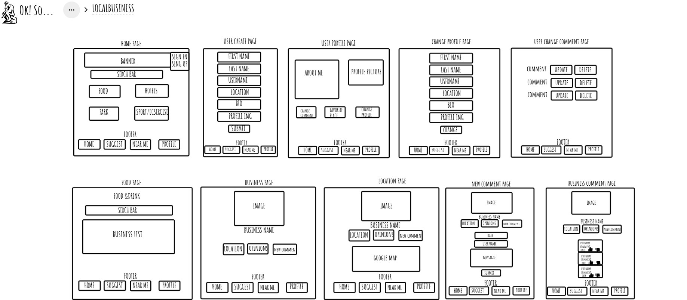
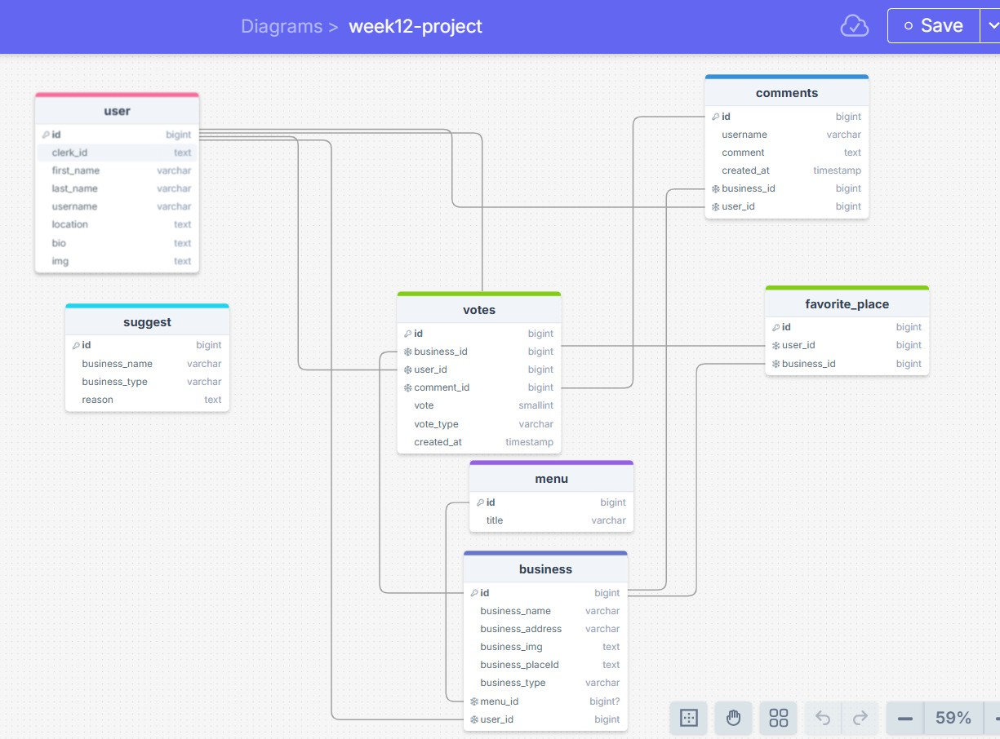
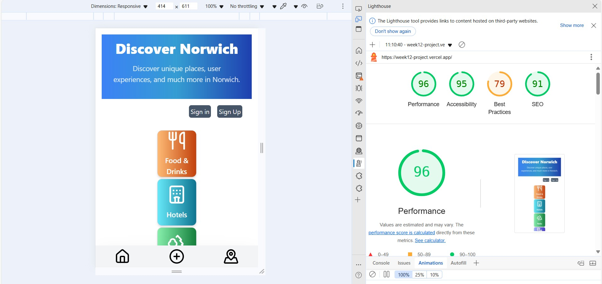

Project name: Discover Norwich
Vercel link: https://week12-project.vercel.app/
Repo link: https://github.com/Imori07/week12-project

Team members: Yurii Pavlenco, Craig Clayton, Yuvraj ,Emine Horozoglu

Project description:

A website that allows people living in Norwich discover unique places, user experiences, and much more in Norwich. Also, it doesn't matter if you are living outside Norwich. Thanks to this website, you will be able to see the businesses close to your location and also find their location on the map using Google Map.

Problem domain: 

Many times when we want to go out and explore a new place or go somewhere close to where we are, we don't know where to go and finding a new place is not always easy.

User stories:

As a user, I want a website where I can easily reach businesses, read reviews about the business, see its location on the map, and also create my own profile page and comment on the businesses I like or delete the comment I have made.
Also, I want to can the businesses close to my location and see the locations of the businesses close to me on the map.

Wireframe:

A list of any libraries, frameworks, or packages that your application requires in order to properly function:

@clerk/nextjs, cors, dotenv, next, nextjs-toploader, pg, react, react-dom, react-icons, lucide-react

Instructions on how to run your app:

- When you open the application, you will see menus. You can see the businesses in them by selecting the menu you want.

- You can use the Discover me button to go to the page of the business you are interested in.

- On the business page, you will see the picture of the business, its address, its location, the comments it has received and an area where you can comment if you wish.

- If you want to comment on the business, you need to create a registration on the web page.

- If you have a user account, use the Sign in button.

- If you do not have a user record, you can create a new account by clicking the Sign Up button. After creating an account, you will be directed to the page where we will create an automatic user profile.

- After creating the profile, you can comment on the business you want, delete the comments you have made or change the profile information.

- If you do not live in Norwich and would like to see businesses close to your location, you can reach them by using the MapPinned button at the bottom of the web page. You can also see their locations on the map by using the see the map button.

- If you have a local business that you would like to add to the site, you can share your idea with us by using the "+" button at the bottom of the web page.

Database Schema:

Lighthouse report:

Reflections:

Overall, we were able to do what we planned to do in the project.

One of our goals was to create a messaging platform where users could talk to each other.
Another goal was to notify users when a new business was added to the website.

References:

https://developers.google.com/maps/documentation/javascript/get-api-key
https://api.yelp.com
https://lucide.dev
